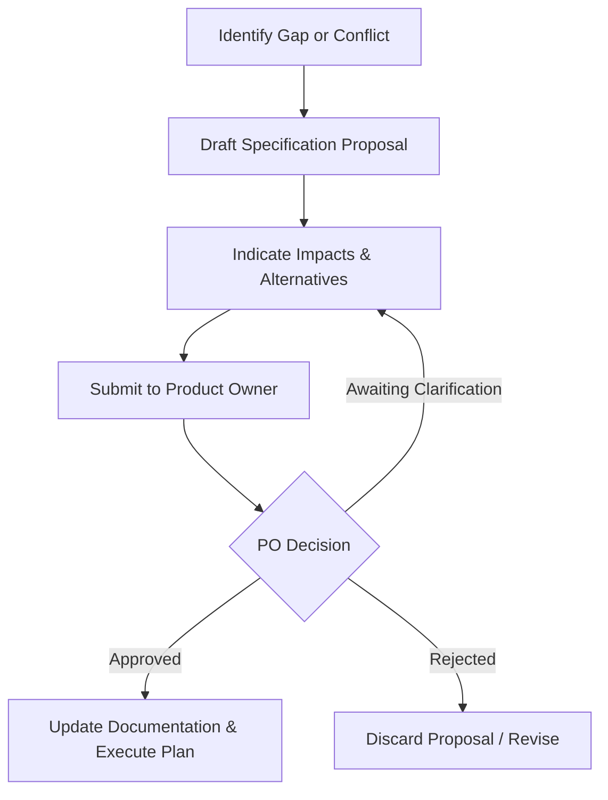

# GOVERNANCE_PROTOCOL.md

# FAPOMS Governance Reference & Protocol

**Field Audit Planning & Operations Management System**  
**Document Type:** Project Governance Reference & Protocol  
**Date:** 2026-07-21  
**Status:** Approved  
**Version:** 1.0  

---

## 1. Purpose

The purpose of this document is to establish the permanent operational rules, sources of truth, recovery procedures, change workflows, and verification standards governing the engineering process of the Field Audit Planning & Operations Management System (FAPOMS). 

All contributors—whether human engineers or agentic AI coding assistants—are bound by this governance reference to ensure architectural integrity, system consistency, and strict alignment with approved business requirements.

---

## 2. Governance Principles

1. **Traceability First:** No design or code changes may be made without establishing direct traceability to an approved business requirements document or explicit Product Owner decision.
2. **Read-Only Session Recovery:** Session recoveries are strictly investigative and context-reconstructing activities. Re-evaluating, modifying, or synthesizing conflicting requirements is prohibited during recovery.
3. **No Unilateral Reconciled Synthesis:** Conflicting specifications must be surfaced and reported exactly as written. They must not be unilaterally resolved or merged.
4. **Product Owner Supremacy:** Any specification modification, rule change, or structural design decision requires explicit, documented Product Owner approval.

---

## 3. Source of Truth Policy

The approved documents in the workspace represent the sole source of truth for the system's specifications, domain models, and architecture.
* Source documents must be referenced by name and section in all analysis and implementation tasks.
* Unofficial notes, developer assumptions, or implied conventions hold zero authority.

---

## 4. Decision Hierarchy

When resolving conflicts or validating specifications, the following order of precedence must be strictly followed:

1. **Product Owner Decisions and Explicit Approvals:** Supersedes all documents.
2. **PROJECT_CONSTITUTION.md:** Governs architecture, engineering principles, and modular boundaries.
3. **Approved Business Specifications:** Governs business requirements and workflows (including `Business Operating Model`, `Business Domain Model`, `Business Rules Catalog`, and the `specification/` subdirectory).
4. **Approved Architecture and Implementation Specifications:** Governs technical implementation plans.
5. **Existing Source Code:** Reflects the specification *only* when there is no documented conflict. Code is treated as a deviation if it conflicts with approved documentation.

---

## 5. Session Recovery Protocol

Session recovery is defined as a read-only activity. The recovering agent must:
1. Read all referenced specifications and code records without skimming.
2. Reconstruct the context of the system status without making structural changes.
3. Identify inconsistencies, log them, and present them for review.

---

## 6. Context Initialization Protocol

Every operational task must start by explicitly identifying the authoritative source documents that will be used. Before producing any analysis, design, implementation, or recommendation, the executing agent must declare which approved documents are being referenced.

---

## 7. Conflict Resolution Policy

If multiple approved documents discuss the same topic and contain discrepancies:
* Compare the documents without modifying or merging their intent.
* Report the inconsistencies exactly as written.
* Mark unresolved conflicts as **Pending Product Owner Decision**.
* Do not infer, reconcile, or elevate one document over another unless an approved governance document explicitly authorizes it.

---

## 8. Traceability Policy

Every statement, conclusion, recommendation, or structural code change must identify its source document. Every conclusion must be traceable. Multiple documents must not be merged into a single conclusion unless all source documents agree. If they disagree, report the disagreement instead of synthesizing.

---

## 9. Specification Change Process

No approved specifications, domain boundaries, or business rules may be modified without a formal request:
1. Identify the proposed spec change.
2. Document the impact of the change on dependencies.
3. Submit the proposal to the Product Owner.
4. Wait for explicit approval before proceeding with implementation.

---

## 10. Product Owner Approval Workflow

---

## 11. Architecture Governance

* The platform must strictly maintain a modular monolithic style with DDD boundaries as defined in [PROJECT_CONSTITUTION.md](file:///Users/deepstacker/WorkSpace/dupcq/gssAutomation/PROJECT_CONSTITUTION.md).
* Circular dependencies between business modules are prohibited.
* Entities of one module must not be imported directly into another module's database registrations; module boundaries must be respected.

---

## 12. Implementation Governance

* Code implementation must strictly align with the approved business domain specification.
* Existing code is secondary to documentation. If a discrepancy exists, the code is considered a deviation.
* Changes to database schemas, APIs, or business logic must have corresponding migration scripts and update files.

---

## 13. Documentation Governance

* All documentation must be kept up to date with implementation.
* If a state machine or API contract is changed, the corresponding shared types and specification documents must be updated simultaneously.
* Keep comments focused on *why* a design decision was made, not *what* the code does.

---

## 14. Definition of Done for Analysis Tasks

An analysis task is complete only when:
* All referenced source documents are explicitly identified and cited.
* Ambiguities and conflicts are identified and listed as **Pending Product Owner Decision**.
* No design synthesis has been performed for conflicting segments.
* Analysis results are recorded in a traceable document.

---

## 15. Definition of Done for Design Tasks

A design task is complete only when:
* Design specifications map directly to business domain requirements.
* Structural boundaries and schemas are checked for circular dependencies.
* Clear migration and implementation strategies are drafted.
* Product Owner approval is received for any deviation from original specs.

---

## 16. Definition of Done for Implementation Tasks

An implementation task is complete only when:
* Code compiles and passes all configured linters.
* Database migration scripts are written and tested.
* Unit and integration tests cover the new business rules.
* The global append-only audit trail is wired to the new mutations.
* Security guards (RBAC/ABAC) are applied to all new controller endpoints.
* Documentation and walkthroughs are updated.

---

## 17. Audit & Compliance Requirements

* The global append-only business audit trail must capture every business state transition.
* Access tokens and refresh tokens must follow security guidelines.
* PII and banking data must be protected and restricted.
