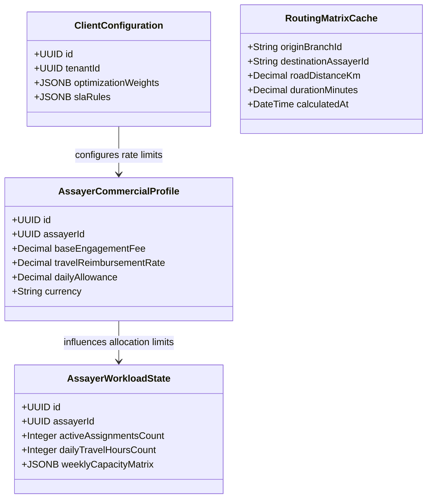

# FAPOMS Enterprise Business & Decision Engine Architecture Proposal

## 1. Enterprise Business Architecture

To support thousands of clients, hundreds of thousands of branches, and millions of audits across multiple organizations and countries, FAPOMS must transition from a monolithic web application into an **Event-Driven, Multi-Tenant Operations Platform**.

### 1.1 Core Architecture Model
We propose a **Modular Kernel with Pluggable Sub-Engines**. The core kernel owns multi-tenant tenancy isolation, basic CRUD master records, and the transaction ledgers, while delegating complex operations (scoring, routing, workflows, cost calculation) to dedicated, stateless engine components.

```
                  ┌───────────────────────────────┐
                  │          API Gateway          │
                  └───────────────┬───────────────┘
                                  │
                  ┌───────────────▼───────────────┐
                  │    Core Multi-Tenant Kernel   │
                  │   (Ledgers, Master Data, RBAC)│
                  └───────────────┬───────────────┘
                                  │
           ┌──────────────────────┴──────────────────────┐
           ▼                                             ▼
┌──────────────────────┐                      ┌──────────────────────┐
│  Message/Event Bus   │                      │  Dynamic Rule Engine │
│  (Redis / RabbitMQ)  │                      │ (JSON-Schema Driven) │
└──────────┬───────────┘                      └──────────┬───────────┘
           │                                             │
   ┌───────┼───────────────────────────┐                 │ (rules)
   ▼       ▼                           ▼                 │
┌──────────────┐ ┌──────────────┐ ┌──────────────┐       │
│ Routing      │ │ Cost         │ │ Optimization │◄──────┘
│ Engine       │ │ Engine       │ │ Engine       │
│ (OSRM/HERE)  │ │ (Contracts)  │ │ (Constraint) │
└──────────────┘ └──────────────┘ └──────────────┘
```

---

## 2. Operational Decision Engine Domain Model

The **Operational Decision Engine** acts as the central coordinator for candidate recommendations and planning optimizations. Instead of a single SQL query calculating distances, it processes an array of dimensions and aggregates them using configurable strategy weights.

### 2.1 Domain Schema & Entity Relationships



### 2.2 Reusable Engine Modules

1. **Routing Engine:** Interfaces with OSRM, HERE, or Mapbox. Resolves real road distances, ETA, and toll calculations. Planners can swap providers via configuration.
2. **Cost Engine:** Computes total assignment costs by combining assayer commercial rates (base fee + daily allowance + distance-based reimbursement) and checks budget headroom.
3. **Capacity Engine:** Tracks workload balances, consecutive travel hours, and holiday/leave collisions.
4. **Negotiation Engine:** Manages workflows for Assayer Offers, counter-offers, acceptance/rejections, expiration windows, and auto-reassignments.
5. **Rule Engine:** Executing JSON-based dynamic business rules for licensing validation, state availability, and priority tier escalations.

---

## 3. Entity Specification & Schema Design

To support this architectural framework, the following new tables are introduced:

### 3.1 `assayer_commercial_profiles`
Stores commercial rates per assayer, allowing currency adjustments and tax-profile matching.

| Field | Type | Constraint | Description |
|---|---|---|---|
| `id` | UUID | Primary Key | Unique Identifier |
| `assayer_id` | UUID | Foreign Key | Reference to `assayers` |
| `base_engagement_fee`| Decimal | NOT NULL | Base fee per audit occurrence |
| `travel_rate_per_km` | Decimal | NOT NULL | Per-kilometer travel reimbursement |
| `daily_allowance` | Decimal | NOT NULL | Meal/accommodation daily rate |
| `currency` | String | Default 'INR' | Billing currency |

### 3.2 `routing_matrix_caches`
Optimizes routing operations by caching distance coordinates, reducing external API dependencies.

| Field | Type | Constraint | Description |
|---|---|---|---|
| `origin_coords` | GEOMETRY | Index | Source coordinates |
| `dest_coords` | GEOMETRY | Index | Destination coordinates |
| `distance_km` | Decimal | NOT NULL | Driving distance |
| `duration_min` | Decimal | NOT NULL | Travel time |

---

## 4. Phased Implementation Roadmap

```
Phase 1: Foundation (Month 1)      Phase 2: Integration (Month 2)     Phase 3: Automation (Month 3)
┌───────────────────────────┐      ┌───────────────────────────┐      ┌───────────────────────────┐
│ • Create Routing Matrix   │      │ • Client SLA Rules        │      │ • Auto Re-assignment      │
│ • Commercial Profiles     ├─────►│ • Multi-Factor Scoring    ├─────►│ • Dynamic Workflows       │
│ • Base Rule Engines       │      │ • BullMQ Worker Setup     │      │ • AI Recommendation Sync  │
└───────────────────────────┘      └───────────────────────────┘      └───────────────────────────┘
```

---

## 5. Migration Strategy

1. **Step 1: DB Schema Expansion:** Deploy the migrations for `assayer_commercial_profiles`, `routing_matrix_caches`, and JSONB configuration columns on `clients` without modifying current service classes.
2. **Step 2: Service Decoupling:** Extract raw SQL queries out of `planning.service.ts` into a separate `GeographicProximityCalculator` class. Integrate the new OSRM Routing adapter.
3. **Step 3: Background Worker Migration:** Wrap planning calls in an asynchronous scheduler loop utilizing BullMQ queues, keeping HTTP response times under 100ms.
