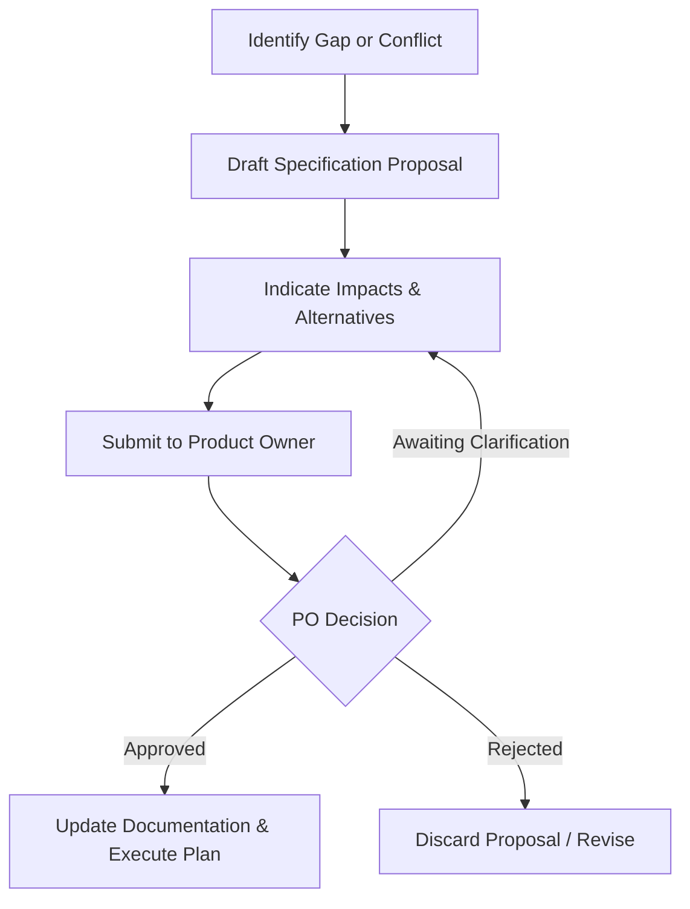

# PROJECT_CONSTITUTION.md

# FAPOMS Project Constitution

## Field Audit Planning & Operations Management System

**Version:** 1.0

---

# Purpose

This constitution defines the engineering principles, architectural rules, and decision-making framework governing the development of the Field Audit Planning & Operations Management System (FAPOMS).

It is the highest-level implementation document.

All contributors—human or AI—must follow this constitution unless an approved revision explicitly supersedes it.

This document governs  **how the system is built** , not  **what the business requires** .

---

# Authority

The documents have the following order of precedence:

1. Project Constitution
2. Business Specifications (Parts 1–10)
3. Approved Architecture Decisions
4. Source Code
5. Internal Comments

If implementation conflicts with the business specifications, the business specifications take precedence.

If business specifications are ambiguous, implementation must not invent new business rules. Instead, the ambiguity must be surfaced for review.

---

# Primary Goal

Build an enterprise-grade platform that is:

* Correct
* Maintainable
* Scalable
* Secure
* Observable
* Extensible

The system should prioritize long-term maintainability over short-term implementation speed.

---

# Guiding Principles

## Business First

Business requirements are the source of truth.

Technology serves the business.

Business terminology must remain consistent throughout the system.

---

## Domain Driven Design

The software should model the business domain.

Business entities should correspond to real business concepts.

Avoid technical models that obscure business meaning.

---

## Separation of Concerns

Keep responsibilities clearly separated.

Business Rules

↓

Application Services

↓

Infrastructure

↓

Persistence

↓

Presentation

No layer should absorb responsibilities belonging to another.

---

## Single Source of Truth

Every business concept should have one authoritative implementation.

Avoid duplicate business logic.

Avoid duplicate calculations.

Avoid duplicate validation.

---

## Explicit over Implicit

Business behavior should always be explicit.

Avoid hidden assumptions.

Avoid undocumented conventions.

Avoid "magic" behavior.

---

## Configuration over Hardcoding

Whenever possible, business behavior should be configurable rather than embedded in code.

Examples:

* Workflow rules
* Notification templates
* Distance thresholds
* SLA values
* Assignment policies

---

## History is Immutable

Business history must never be rewritten.

Corrections create new records or versions.

Audit history is append-only.

---

## Human Decision Support

The platform assists users.

It does not replace operational judgment.

Recommendation engines suggest.

Authorized users decide.

---

# Engineering Principles

## Modular Architecture

Modules should be:

* Independent
* Loosely coupled
* Highly cohesive

Avoid cyclic dependencies.

---

## API First

Internal module interactions should use well-defined contracts.

Avoid tightly coupled implementations.

---

## Stateless Services

Business services should remain stateless wherever practical.

Persistent state belongs in the data layer.

---

## Dependency Direction

Dependencies should point inward toward the business domain.

Infrastructure must not dictate business behavior.

---

## Simplicity

Choose the simplest design that satisfies the business requirements.

Avoid unnecessary abstraction.

Avoid premature optimization.

---

## Scalability

Design assuming future growth.

Support expansion without redesign.

Examples:

* Additional clients
* Additional organizations
* Additional audit types
* Higher transaction volumes

---

# Data Principles

Master data and transactional data remain separate.

Every business entity owns its lifecycle.

Business identifiers remain separate from system identifiers.

Soft delete is preferred over physical deletion for business entities.

Historical relationships must remain valid.

---

# Security Principles

Least privilege by default.

Every request must be authenticated.

Every business operation must be authorized.

Security must never depend solely on the frontend.

Audit security-sensitive actions.

---

# Quality Principles

Every business rule should have automated tests.

Critical workflows should have integration tests.

Defects should be fixed at the root cause.

Avoid temporary workarounds becoming permanent architecture.

---

# Error Handling

Errors should be:

* Explicit
* Actionable
* Logged
* Traceable

Never silently ignore failures.

Never suppress exceptions that indicate data inconsistency.

---

# Observability

The platform should expose sufficient telemetry to understand system behavior.

Include:

* Structured logging
* Metrics
* Health checks
* Error tracking
* Audit events

Business events and technical events should be distinguishable.

---

# Performance

Optimize only after correctness.

Avoid premature optimization.

Prioritize:

* Fast search
* Responsive planning
* Efficient filtering
* Predictable performance

Performance improvements must not compromise correctness.

---

# Documentation

Major architectural decisions should be documented.

Business terminology should remain consistent.

Code should be self-explanatory where possible.

Comments explain  *why* , not  *what* .

---

# Artificial Intelligence Usage

AI assistants may:

* Generate code
* Refactor code
* Generate tests
* Produce documentation
* Suggest architecture

AI assistants must not:

* Invent business rules
* Rename business concepts
* Remove auditability
* Reduce security
* Introduce unnecessary complexity

If ambiguity exists, the AI should identify it and request clarification.

---

# Architectural Decision Making

When multiple valid technical approaches exist, choose the one that best satisfies:

1. Business correctness
2. Simplicity
3. Maintainability
4. Testability
5. Scalability
6. Performance

Novelty is never a goal.

---

# Backward Compatibility

Changes to business behavior require explicit approval.

Changes to implementation are acceptable provided business behavior remains unchanged.

Database migrations should preserve historical data.

---

# Coding Standards

Use consistent naming.

Prefer descriptive names over abbreviations.

Avoid duplicate code.

Keep functions focused on a single responsibility.

Prefer composition over inheritance unless inheritance clearly models the domain.

---

# Definition of Done

A feature is complete only when:

* Business requirements are satisfied.
* Authorization is enforced.
* Validation is implemented.
* Audit events are recorded.
* Error handling is complete.
* Tests pass.
* Documentation is updated.
* Performance is acceptable.
* Code review issues are resolved.

Implementation alone does not constitute completion.

---

# Decision Framework

When faced with uncertainty:

1. Consult the business specifications.
2. Search for an existing architectural pattern.
3. Prefer consistency over novelty.
4. Avoid assumptions about business behavior.
5. Escalate unresolved ambiguities.

---

# Non-Negotiable Rules

The following must never be violated:

* Business specifications are the source of truth.
* Business history is immutable.
* Authorization is mandatory.
* Business logic must not be duplicated.
* Every critical operation must be auditable.
* Modules must remain loosely coupled.
* Business identifiers remain independent of system identifiers.
* User decisions take precedence over automated recommendations.
* Configuration is preferred over hardcoding.
* The system should evolve without requiring architectural rewrites.

---

# Session Governance

All engineering sessions and tasks are bound by the following mandatory governance rules:

* **Context Initialization:** Every task must begin by identifying the authoritative source documents that will be used. Before producing any analysis, design, implementation, or recommendation, the executing agent must explicitly state which approved documents are being referenced.
* **Authoritative Source Identification:** Refer to [GOVERNANCE_PROTOCOL.md](file:///Users/deepstacker/WorkSpace/dupcq/gssAutomation/GOVERNANCE_PROTOCOL.md) for the mapping of authoritative sources.
* **Decision Hierarchy:** Refer to [GOVERNANCE_PROTOCOL.md](file:///Users/deepstacker/WorkSpace/dupcq/gssAutomation/GOVERNANCE_PROTOCOL.md) §Decision Hierarchy.
* **Conflict Handling:** If multiple approved documents conflict, compare them without modifying or merging their intent. Report the inconsistencies exactly as written, and mark unresolved conflicts as **Pending Product Owner Decision**. Do not resolve them yourself or elevate one document over another.
* **Traceability Requirements:** Every statement, conclusion, or recommendation must be traceable to one or more approved sources.
* **Working Agreement:** Do not redesign approved artifacts, introduce new business concepts, modify business rules, or change domain boundaries unless explicitly instructed by the Product Owner.
* **Change Management:** Proposing changes to approved specifications requires Product Owner review and approval.
* **Product Owner Approval:** Specification changes must not be implemented until explicit Product Owner approval is documented.

For detailed procedures, refer to [GOVERNANCE_PROTOCOL.md](file:///Users/deepstacker/WorkSpace/dupcq/gssAutomation/GOVERNANCE_PROTOCOL.md).

---

# Final Statement

The purpose of this constitution is to ensure that every implementation decision remains aligned with the business domain while producing software that is robust, maintainable, scalable, and suitable for long-term enterprise use.

All engineering decisions should be evaluated against these principles and [GOVERNANCE_PROTOCOL.md](file:///Users/deepstacker/WorkSpace/dupcq/gssAutomation/GOVERNANCE_PROTOCOL.md) before implementation.
# GOVERNANCE_PROTOCOL.md

# FAPOMS Governance Reference & Protocol

**Field Audit Planning & Operations Management System**  
**Document Type:** Project Governance Reference & Protocol  
**Date:** 2026-07-21  
**Status:** Approved  
**Version:** 1.0  

---

## 1. Purpose

The purpose of this document is to establish the permanent operational rules, sources of truth, recovery procedures, change workflows, and verification standards governing the engineering process of the Field Audit Planning & Operations Management System (FAPOMS). 

All contributors—whether human engineers or agentic AI coding assistants—are bound by this governance reference to ensure architectural integrity, system consistency, and strict alignment with approved business requirements.

---

## 2. Governance Principles

1. **Traceability First:** No design or code changes may be made without establishing direct traceability to an approved business requirements document or explicit Product Owner decision.
2. **Read-Only Session Recovery:** Session recoveries are strictly investigative and context-reconstructing activities. Re-evaluating, modifying, or synthesizing conflicting requirements is prohibited during recovery.
3. **No Unilateral Reconciled Synthesis:** Conflicting specifications must be surfaced and reported exactly as written. They must not be unilaterally resolved or merged.
4. **Product Owner Supremacy:** Any specification modification, rule change, or structural design decision requires explicit, documented Product Owner approval.

---

## 3. Source of Truth Policy

The approved documents in the workspace represent the sole source of truth for the system's specifications, domain models, and architecture.
* Source documents must be referenced by name and section in all analysis and implementation tasks.
* Unofficial notes, developer assumptions, or implied conventions hold zero authority.

---

## 4. Decision Hierarchy

When resolving conflicts or validating specifications, the following order of precedence must be strictly followed:

1. **Product Owner Decisions and Explicit Approvals:** Supersedes all documents.
2. **PROJECT_CONSTITUTION.md:** Governs architecture, engineering principles, and modular boundaries.
3. **Approved Business Specifications:** Governs business requirements and workflows (including `Business Operating Model`, `Business Domain Model`, `Business Rules Catalog`, and the `specification/` subdirectory).
4. **Approved Architecture and Implementation Specifications:** Governs technical implementation plans.
5. **Existing Source Code:** Reflects the specification *only* when there is no documented conflict. Code is treated as a deviation if it conflicts with approved documentation.

---

## 5. Session Recovery Protocol

Session recovery is defined as a read-only activity. The recovering agent must:
1. Read all referenced specifications and code records without skimming.
2. Reconstruct the context of the system status without making structural changes.
3. Identify inconsistencies, log them, and present them for review.

---

## 6. Context Initialization Protocol

Every operational task must start by explicitly identifying the authoritative source documents that will be used. Before producing any analysis, design, implementation, or recommendation, the executing agent must declare which approved documents are being referenced.

---

## 7. Conflict Resolution Policy

If multiple approved documents discuss the same topic and contain discrepancies:
* Compare the documents without modifying or merging their intent.
* Report the inconsistencies exactly as written.
* Mark unresolved conflicts as **Pending Product Owner Decision**.
* Do not infer, reconcile, or elevate one document over another unless an approved governance document explicitly authorizes it.

---

## 8. Traceability Policy

Every statement, conclusion, recommendation, or structural code change must identify its source document. Every conclusion must be traceable. Multiple documents must not be merged into a single conclusion unless all source documents agree. If they disagree, report the disagreement instead of synthesizing.

---

## 9. Specification Change Process

No approved specifications, domain boundaries, or business rules may be modified without a formal request:
1. Identify the proposed spec change.
2. Document the impact of the change on dependencies.
3. Submit the proposal to the Product Owner.
4. Wait for explicit approval before proceeding with implementation.

---

## 10. Product Owner Approval Workflow

---

## 11. Architecture Governance

* The platform must strictly maintain a modular monolithic style with DDD boundaries as defined in [PROJECT_CONSTITUTION.md](file:///Users/deepstacker/WorkSpace/dupcq/gssAutomation/PROJECT_CONSTITUTION.md).
* Circular dependencies between business modules are prohibited.
* Entities of one module must not be imported directly into another module's database registrations; module boundaries must be respected.

---

## 12. Implementation Governance

* Code implementation must strictly align with the approved business domain specification.
* Existing code is secondary to documentation. If a discrepancy exists, the code is considered a deviation.
* Changes to database schemas, APIs, or business logic must have corresponding migration scripts and update files.

---

## 13. Documentation Governance

* All documentation must be kept up to date with implementation.
* If a state machine or API contract is changed, the corresponding shared types and specification documents must be updated simultaneously.
* Keep comments focused on *why* a design decision was made, not *what* the code does.

---

## 14. Definition of Done for Analysis Tasks

An analysis task is complete only when:
* All referenced source documents are explicitly identified and cited.
* Ambiguities and conflicts are identified and listed as **Pending Product Owner Decision**.
* No design synthesis has been performed for conflicting segments.
* Analysis results are recorded in a traceable document.

---

## 15. Definition of Done for Design Tasks

A design task is complete only when:
* Design specifications map directly to business domain requirements.
* Structural boundaries and schemas are checked for circular dependencies.
* Clear migration and implementation strategies are drafted.
* Product Owner approval is received for any deviation from original specs.

---

## 16. Definition of Done for Implementation Tasks

An implementation task is complete only when:
* Code compiles and passes all configured linters.
* Database migration scripts are written and tested.
* Unit and integration tests cover the new business rules.
* The global append-only audit trail is wired to the new mutations.
* Security guards (RBAC/ABAC) are applied to all new controller endpoints.
* Documentation and walkthroughs are updated.

---

## 17. Audit & Compliance Requirements

* The global append-only business audit trail must capture every business state transition.
* Access tokens and refresh tokens must follow security guidelines.
* PII and banking data must be protected and restricted.
