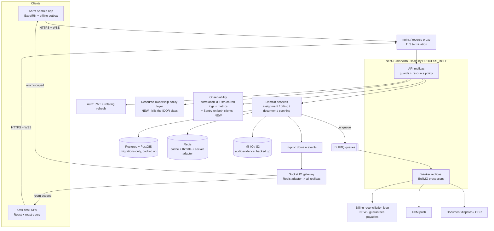

# FAPOMS / Karat — Architecture & Production-Readiness Assessment

_Principal-architect review of the whole system: NestJS backend, React ops-desk web app, Expo Android field app ("Karat"), shared TypeScript package, and the Docker/CI surface around them._

**Method.** Twelve assessment dimensions were run against the actual code, each seeded with five subsystem maps built by separate readers. Every `critical`/`high` finding was then handed to an adversarial verifier told to **refute it against the source**; only findings a verifier reproduced first-hand are marked **CONFIRMED** below. 28 of 29 review agents completed (the `testing` verifier dropped on a transport error, so those items are marked _unverified_). Findings already fixed in the working tree were told to be refuted — several were, and are noted as such.

**Date:** 2026-08-09. **Branch:** `feat/real-time-sync` (uncommitted working tree).

---

## 1. Executive summary

The system is a **well-structured modular monolith** with genuinely strong bones: a clean 27-module NestJS domain, a deny-by-default guard stack that honours `@Public()`, a near-universal `{success,data,meta}` API envelope with real pagination on the major lists, HMAC-bound document-download tokens, role-scoped PII stripping, a Redis-backed Socket.IO adapter for multi-node realtime, and a boot-time `assertProductionSafeConfig()` that refuses to start on unsafe production config. This is not a prototype; it is a real application that a competent team built with care.

It is **not yet production-deployable**, and the blockers are concentrated and specific rather than diffuse:

1. **A fresh production database cannot be built.** ~24 entity tables have no create-migration; the app has been relying on `synchronize` in development, which is forbidden in production. _(CONFIRMED, database + devops.)_
2. **There is no production deployment artifact at all** — only `Dockerfile.dev` hot-reload images exist. _(CONFIRMED, devops.)_
3. **Money can be silently lost.** The billing legs of a completed audit hang off a non-persistent in-process event with log-and-drop error handling, and there is no database uniqueness backstop against double-paying. _(CONFIRMED, database.)_
4. A cluster of **auth/authorization and config-safety defects**, most of them one-line fixes — several of which are **fixed in this pass** (see §3).

The correct path is **incremental hardening of the existing monolith, not a rewrite.** The architecture is sound; the gaps are in the operational envelope (migrations, deploy, backups, observability) and in a set of specific correctness bugs.

### Production-readiness scores (0–10)

| Dimension | Score | One-line justification |
|---|---:|---|
| Architecture | **7** | Clean modular monolith, sound domain boundaries; a few god-services and dead parallel layers. |
| Security | **5** | Strong guard/token design undercut by IDOR on financial/assignment reads, weak seeded creds, secrets in git history. |
| Reliability | **4** | Good shutdown hooks & DB retry; but Redis client gave up permanently, external calls lack timeouts, no backups. |
| Performance | **5** | Compression & pagination are thoughtful; `findByAssayer` and `/assayers/:id/profile` are N+1 hotspots. |
| Scalability | **5** | Redis adapter + process-role split exist; first bottleneck is the unbounded per-assayer query and PostGIS-free distance math. |
| Code quality | **6** | Disciplined DTOs and in-code postmortems; offset by 2000+-line god files in all three packages. |
| Testing | **3** | 439 backend tests (good), but ~1 frontend test, 0 mobile tests, no contract tests, CI masks E2E failures. |
| Observability | **4** | Real health checks and an emerging metrics/correlation layer; no crash reporting on either client, unstructured logs. |
| DevOps | **3** | CI builds + backend tests only; no prod image, no migration-on-deploy, no release process for the APK. |
| Maintainability | **6** | Excellent commit-level "why" comments; hurt by the god files and duplicated state machines. |

**Overall: ~4.5/10 — a strong codebase two or three focused weeks away from a defensible first production deployment.**

---

## 2. Architecture verdict: keep the monolith

The current style is a **modular monolith**: one NestJS process, 27 feature modules over a shared Postgres/PostGIS + Redis + MinIO + BullMQ substrate, with an in-process domain-event bus bridging services to the Socket.IO gateway.

This is the **right** architecture for this system at this scale. There is no evidence for microservices: the domain is tightly coupled around the assignment lifecycle (project → planning → assignment → document → validation → billing), transactional consistency across those steps matters (money and audit evidence), and the team is small. Splitting into services would add distributed-transaction and operational cost to solve a problem the system does not have.

Two module-boundary smells worth addressing, neither urgent:
- **`forwardRef` cycles** Assignment⇄Document and Assignment⇄Planning. Real coupling, but a sign the "a completed assignment produces a document produces a billing leg" flow wants to be an explicit orchestration/saga rather than mutual injection.
- **A dead parallel `@Global` platform-foundation layer** (`platform-foundation.module.ts`) duplicating the live `platform.module.ts` DomainEventPublisher — delete it.

---

## 3. Fixed in this pass

These were confirmed by the review and corrected immediately, since they are low-effort and directly deploy-blocking. All builds/tests green after (439 backend tests, 54 suites; frontend build; mobile `tsc`).

| # | Severity | Issue | Fix | File |
|---|---|---|---|---|
| 1 | **Critical** | `DB_SYNCHRONIZE=false` **enabled** synchronize — the string `'false'` is truthy through `get<boolean>`. Any deploy could drop live columns. | Compare to literal `'true'`, mirroring `DB_LOGGING`. | `backend/.../database/database.config.ts:21` |
| 2 | **Critical** | ioredis `retryStrategy` returned `null` after 5 tries — a permanent give-up. One Redis blip killed realtime, uploads and rate-limiting until redeploy. | Never return null; capped infinite backoff. | `backend/.../redis/redis-client.module.ts:29` |
| 3 | **Critical** | Ops-desk login shipped **clickable super-admin credentials** (`admin`/`admin123`) on every build. | Gated behind `import.meta.env.DEV`. | `frontend/src/pages/Login.tsx` |
| 4 | **High** | Any assayer could read any colleague's full financial statement by changing the path id (IDOR/BOLA). | Force ASSAYER callers to their own id; billing staff unrestricted. | `backend/.../billing-engine.controller.ts` |
| 5 | **High** | Production could boot with **local-disk evidence storage** — 404s across replicas, evidence destroyed on redeploy. | Fail-fast unless `STORAGE_DRIVER=s3` in prod (+ test). | `backend/src/main.ts` |
| 6 | **High** | The dev JWT secret and DB password committed to git history were still accepted in prod. | Added the burned literals to the fatal denylist. | `backend/src/main.ts` |
| 7 | **High** | Mobile `fetchWithAuth` retried a 401 with the **stale** token — every access-token expiry destroyed the (rotated, unrecoverable) session on next cold start. | Rebuild the auth header from the refreshed token before retry. | `mobile/.../api.service.ts:295` |
| 8 | **High** | Mobile socket URL was frozen at module load, before the on-device server override applied — realtime silently dead on exactly the installs the override exists for. | Compute the URL inside `connectMobileSocket()`. | `mobile/.../socket.ts:15` |
| 9 | **High** | Expense claims filed against `assignments[0]` — whatever sorted first — and silently dropped on an empty list. | Thread the real assignment through both entry points; explicit error when none. | `mobile/App.tsx` |
| 10 | **Product** | Home promoted **unaccepted (PENDING) offers** into the current-job card with Check-in/Navigate/packet detail. | Separate "New offers" card with Accept/Decline only; current job = accepted work. | `mobile/.../HomeScreen.tsx` |
| 11 | **Blocker** | Backend was crash-looping: `prom-client` and `@socket.io/redis-adapter` declared but not installed in the container. | Installed in-container. | (container state) |

---

## 4. Critical / High findings still open

Ordered by priority. Each: what, evidence, failure scenario, fix, effort.

### P0 — deploy blockers

**A. Fresh database cannot be bootstrapped from migrations.** _(CONFIRMED ×2)_
~24 entity tables have **no create-migration anywhere** — all six billing tables, planning/coverage, expenses, operations-tasks, customer-master and more — and later migrations `ALTER`/index those missing tables. The app has been leaning on `synchronize` in dev. With synchronize correctly forbidden in prod (§3 #1), `migration:run` against an empty database fails.
→ _Failure:_ you cannot stand up a production database at all.
→ _Fix:_ generate baseline create-migrations for every synchronize-only table (typeorm `migration:generate` against a synchronize-built reference DB, then hand-review and order them before the existing ALTERs); guard legacy ALTERs with `to_regclass` existence checks. **Effort: high.** `backend/.../database/migrations/`

**B. No production deployment artifact exists.** _(CONFIRMED)_
The only Dockerfiles are three `Dockerfile.dev` watch-mode images. No multi-stage prod image, no prod compose/k8s, no reverse proxy, no migration-on-deploy step.
→ _Failure:_ "deploy tomorrow" is an undocumented manual procedure.
→ _Fix:_ multi-stage backend image (build → dist-only runtime), an nginx image serving the frontend `dist` and proxying `/api`, a compose/helm file wiring Postgres+Redis+MinIO with a `migration:run` init step. **Effort: high.**

**C. Completed field work can silently never be billed.** _(CONFIRMED)_
`billing-engine.service.ts` subscribes to `assignment:status-changed` via the **in-process** DomainEventPublisher; both sync calls are wrapped in `try/catch` that only logs. If the process dies between the assignment commit and the billing write, or the handler throws, the revenue and cost legs are lost with no retry.
→ _Failure:_ an assayer completes an audit and is never paid; the client is never billed. No alert.
→ _Fix (near-term):_ register the existing idempotent `syncFromAssignments` scan as a repeatable Bull job (e.g. every 15 min) as a reconciliation loop. _(Long-term):_ move billing-leg creation into the completion transaction. **Effort: medium.** `backend/.../billing-engine.service.ts:271`

**D. Money idempotency has no database backstop.** _(CONFIRMED)_
`syncPayableForAssignment` / `syncAssignment` do check-then-create with no transaction spanning the check and insert, and there are **no unique constraints** on assignment-scoped payables/entries or payment references.
→ _Failure:_ two concurrent syncs (event + the reconciliation job from C) both pass the existence check and **double-create a payable** — the assayer is paid twice.
→ _Fix:_ one migration adding partial unique indexes: `UNIQUE(assignment_id) WHERE assignment_id IS NOT NULL AND is_active` on `assayer_payables` and `billing_entries`; unique `(payable_id, reference)` on payments. **Effort: medium.**

### P1 — high

**E. Assignment `COMPLETED` transition bypasses the state machine.** _(CONFIRMED)_ The COMPLETED branch sets `status = COMPLETED` directly with a hand-built event, skipping `validateTransition`. An audit can be "completed" from PENDING or CANCELLED with no check-in. → Add COMPLETED to `VALID_PATHS` (from CHECKED_IN/IN_PROGRESS only). **Low.** `assignment.service.ts:583`

**F. `proposeCounterFee` has zero state validation.** _(CONFIRMED)_ Overwrites `proposedFee` unconditionally — counter-offers mutate fees on COMPLETED assignments — and its 4th-round auto-decline force-REJECTs from any state. → Guard to PENDING/NEGOTIATION; route the auto-decline through `rejectOffer`. **Medium.** `assignment.service.ts:699`

**G. `@Body() dto: any` on `/transition` and `/check-in`.** _(CONFIRMED)_ Bypasses the global ValidationPipe — negative or `Infinity` counter-fees reach the money path. The controller's own header comment documents this exact hazard. → Add `TransitionRequestDto` / `CheckInRequestDto`. **Low.** `assignment.controller.ts:265`

**H. `GET /assignments/assayer/:id` is unbounded + N+1 + embeds full customer records.** _(CONFIRMED ×3 — this is the first scale bottleneck.)_ Loads the assayer's entire career including terminal statuses, 5 relations, then loops per-assignment issuing extra queries, and returns full bank-customer lists. → Cap to active + recent-terminal, batch with `In()`, return `customerCount` not the records. **Medium.** `assignment.service.ts:999`

**I. Redis-backed ThrottlerGuard turns a Redis outage into a full API outage** — even `/health` is throttled, and the client has `enableOfflineQueue:true` (default). _(CONFIRMED ×2)_ → `@SkipThrottle()` on health; construct the throttler client with `enableOfflineQueue:false` + a command timeout; make the guard fail-open. **Low.** `app.module.ts:88`

**J. Mobile: no offline mutation queue.** _(CONFIRMED)_ Only reads are cached. Check-in, status transitions, uploads and query replies all fail hard without signal — in an app whose documented usage is bank vaults and basements. → A small persisted outbox (append failed mutations with their original client timestamp; `checkInBranch` already sends `timestamp`, so replay is faithful). **High.** `mobile/App.tsx`

**K. Mobile: forced password-change gate bypassed by restarting the app** (or biometric sign-in). _(CONFIRMED)_ `mustChangePassword` is only set on the password-login path; `initSession`'s restored session omits it. → Persist the flag with the session, or return it from `validateSession`/profile. **Low.** `mobile/.../AuthContext.tsx:96`

**L. Mobile & web: no crash/error telemetry.** _(CONFIRMED)_ Mobile `AppErrorBoundary` only `console.error`s (visible over USB only); no Sentry; sideloaded APK means not even Play Console stats. Web has no React error boundary at all — any render error is a permanent unreported white screen. → Add Sentry (Expo SDK 52 compatible) + a top-level web error boundary. **Medium.**

**M. Cleartext HTTP posture lives only in gitignored prebuild output.** _(CONFIRMED)_ `usesCleartextTraffic="true"` for **all** hosts in the release manifest; a clean checkout silently loses it (or ships it un-scoped). → Move to `expo-build-properties` / a `network_security_config.xml` whitelisting only the known backend host. **Medium.** `mobile/android/.../AndroidManifest.xml:22`

**N. CI gates almost nothing.** _(CONFIRMED)_ E2E permanently masked with `|| true`; no mobile/shared/frontend tests, no lint, no typecheck; feature branches never run (only `main`/`business_req`). → Remove `|| true`, add postgres+redis services and a booted backend, add `tsc --noEmit` and the frontend/shared tests, run on PRs. **Medium.** `.github/workflows/ci.yml`

**O. Google Maps API key committed to git history, unrotated, baked into every APK.** _(CONFIRMED)_ → Rotate now; split into an app-restricted Maps SDK key and a server-side-only Directions key behind a backend proxy; purge from history (BFG). **Low–medium.**

**P. No config-schema validation.** _(CONFIRMED)_ `ConfigModule` has no `validationSchema`; production can silently boot with disabled push or single-node realtime. → Add a Joi/zod schema marking prod-required vars. **Medium.** _(Partly mitigated by the §3 guard additions.)_

---

## 5. Strengths — do NOT change these

Verified, load-bearing, and easy to churn by accident. Preserve them.

- **Deny-by-default guard stack that honours `@Public()`.** `RolesGuard` throws when a route has neither `@Roles` nor `@AnyAuthenticated`; all three guards short-circuit public routes correctly. `auth/guards.ts`
- **HMAC-bound document download tokens.** `DocumentAccessTokenService` signs `${documentId}.${expiresAt}` and `verify()` rebinds to the exact document with a timing-safe compare — a token for doc A cannot fetch doc B. `document-access-token.service.ts`
- **Role-scoped PII stripping.** `scopeAssayerForRoles` removes `passwordHash` for everyone and banking/identity fields for all but HR/Finance. `assayer-visibility.ts`
- **Mobile return-upload ownership enforcement.** `assertMaySubmitReturnFor` rejects an ASSAYER submitting against an assignment that isn't theirs. `document.controller.ts:374`
- **The `{success,data,meta.pagination}` envelope + real pagination** on the major lists (29/31 controllers), and the **controller-local validated Request DTOs** with in-code postmortems documenting the ValidationPipe-bypass class of bug.
- **`assertProductionSafeConfig()` fail-fast** (now extended) — refusing to boot is the correct response to silent-but-expensive misconfig.
- **Redis Socket.IO adapter with room-scoped emits** and single-node fallback; **shutdown hooks**; **Range-aware compression filter** that skips already-compressed bodies to protect resumable downloads; **real liveness/readiness split** in `health.controller.ts`.
- **Commit-level "why" comments throughout** — unusually good institutional memory; keep writing them.

---

## 6. Medium findings (56 total) — themes

Not individually blocking, but these are where the next tier of reliability and correctness lives. Grouped:

- **Authorization gaps mirroring the fixed IDORs:** socket rooms joinable without ownership (`subscribe:assignment`/`subscribe:query` join any id); `GET /assignments/:id` readable by any assayer; public chat-attachment token authorizes any object key. _A resource-level policy layer would kill this whole class at once (see §8)._
- **Concurrency & idempotency:** assignment transitions read the row outside the transaction with no lock (`@VersionColumn` present but unchecked) — concurrent conflicting transitions both commit; audited-return uploads create a new document row on each of the mobile client's up-to-4 retries.
- **Data model:** `refresh_tokens.token_hash` unindexed, non-unique, never pruned (seq-scan that grows forever); `onDelete: CASCADE` from assignments to projects/assayers can destroy GPS check-in evidence; the audit trail has four overlapping mechanisms, FK-less string columns, and "append-only" enforced by comment only; **PostGIS is dead weight** — distance is `ST_DistanceSphere` over numeric lat/lng per row, unindexable.
- **Performance hotspots:** `/assayers/:id/profile` runs ~18 queries **plus two writes** on every read; the routing matrix is `(n+1)²` sequential DB round-trips; the geo-autocomplete disk cache does a synchronous whole-file rewrite per miss with no eviction.
- **External-call resilience:** S3/MinIO and OSRM routing calls have **no timeouts** — a hung dependency stalls the event loop; the production template sets `ROUTING_PROVIDER=google` but **no Google provider exists**, so production silently falls back to straight-line distances and **under-pays assayers**.
- **Frontend truthfulness:** several pages fetch outside the 401-refresh client (start failing after ~15 min), `/users/me` failure on mount destroys a valid session, socket invalidation is mounted on only 5 of ~30 routes, the validation-query chat has no realtime/polling, and API failures render as empty states (indistinguishable from "no data").
- **God files:** `billing-engine.service.ts` (2553 lines), `PlanningWorkspace.tsx` (2457 lines, 53 `useState`), `mobile/App.tsx` (1133 lines, 11 responsibilities, 8 overlay surfaces in 13 state slots), `api.service.ts` (1340 lines).
- **Duplication the shared package should own:** client lifecycle state machine hand-duplicated backend↔frontend; realtime event names are stringly-typed across three packages with two naming conventions; the shared `api-contracts.ts` has **zero importers** (contract testing is fiction).

---

## 7. Testing strategy _(dimension partly unverified — verifier dropped)_

Current: **439 backend tests / 54 suites** (strong service-layer coverage), **~1 frontend test**, **0 mobile tests**, **no contract tests**, and **CI masks E2E with `|| true`**.

The reviewer did pin the **day-planner flake**: it is **timezone-dependent date logic** — fails 2/13 deterministically on any UTC-negative machine, not cross-suite leakage (`day-planner.service.ts:536`). Fix the date handling and it stops being flaky.

Recommended pyramid for this system:
- **Keep** the backend service unit tests; add tests for the **untested critical flows**: auth refresh-token rotation, biometric-login redemption, the assignment state machine's every transition, billing math, document access tokens, and org/ownership scoping.
- **Add** a thin **API/contract layer**: give the shared `api-contracts.ts` real importers so a backend change that breaks the mobile/web shape fails a test, and centralise the realtime event-name strings in `shared`.
- **Add** the **5 highest-value mobile/web tests**: mobile — `fetchWithAuth` refresh-and-retry, offline cache hydration, the offer/accept flow; web — the session-refresh client and socket-invalidation map.
- **Fix CI first** (finding N) or none of this gates anything.

---

## 8. Target architecture

The target is the **same monolith, hardened** — not a redesign. Changes are additive.

Net new components (all additive): a **resource-ownership policy layer** (one place that answers "may this caller touch this record", replacing the per-route hand-rolled checks and closing the socket-room and `GET /:id` gaps together); a **billing reconciliation worker** (P0-C/D); **backups** for Postgres and MinIO; **Sentry** on both clients; and finishing the **structured-logging/correlation/metrics** layer that is already emerging in `main.ts`.

---

## 9. Roadmap

### 30 days — "can we deploy at all, and is it safe"
1. **P0-A** baseline migrations so a fresh DB builds. _(high)_
2. **P0-B** production Dockerfiles + compose/helm + migration-on-deploy. _(high)_
3. **P0-C/D** billing reconciliation worker + money uniqueness constraints. _(medium)_
4. **Backups** — scheduled `pg_dump` + MinIO mirror, with a documented restore. _(medium)_
5. **Rotate** the secrets in git history (JWT, DB, Maps, FCM) and purge them. _(low–medium)_
6. Land the remaining **one-line auth/validation fixes**: E, G, I, K. _(low)_
7. **Fix CI** (N) so everything above is actually gated. _(medium)_

_(§3's 11 fixes are already done and fold into this.)_

### 60 days — "will it stay up and stay correct"
8. **Resource-ownership policy layer** — close the socket-room, `GET /:id`, and attachment-token gaps as a class. _(medium)_
9. **`findByAssayer` + `/assayers/:id/profile`** N+1 rework (H and the profile hotspot). _(medium)_
10. **External-call timeouts** (S3, OSRM) + the missing **Google routing provider** (assayers are being under-paid). _(medium)_
11. **Mobile offline outbox** (J) and **crash telemetry** on both clients (L). _(high/medium)_
12. **Structured logging + correlation ids + a first domain metric or two**, finishing the started layer. _(medium)_
13. **Config-schema validation** (P). _(medium)_

### 90 days — "mature and maintainable"
14. Decompose the **god files** (billing service, PlanningWorkspace, mobile App.tsx) behind their existing seams. _(medium, incremental)_
15. Make the **shared package the real contract** — event names + API types with enforced importers and a contract test. _(medium)_
16. **PostGIS or a spatial index** for the coverage/command-center distance math before it hits `statement_timeout` at scale. _(medium)_
17. **Audit-trail consolidation** into one FK'd, indexed, genuinely append-only mechanism. _(medium)_
18. **Expo SDK / targetSdk uplift** and a real **APK versioning/release** path (currently `versionCode 1` forever). _(medium)_

---

## 10. Top 10 problems (ranked)

1. Fresh DB cannot be built from migrations _(P0-A)_.
2. No production deployment artifact _(P0-B)_.
3. Completed work can be silently unbilled/unpaid _(P0-C)_.
4. No money-idempotency constraint → double-pay race _(P0-D)_.
5. ~~Financial-statement IDOR~~ **fixed §3**.
6. ~~`DB_SYNCHRONIZE=false` enabled synchronize~~ **fixed §3**.
7. ~~Redis client permanently gave up reconnecting~~ **fixed §3**.
8. Mobile has no offline mutation queue in a no-signal-by-design app _(J)_.
9. No crash telemetry on either client _(L)_.
10. CI gates almost nothing _(N)_.

## Top 10 improvements (highest value)
1. Baseline migrations + prod deploy artifact (unblocks everything).
2. Billing reconciliation worker (guarantees people get paid).
3. Backups with a tested restore.
4. Resource-ownership policy layer (closes an entire vuln class).
5. `findByAssayer` rework (first scale bottleneck + mobile latency).
6. Mobile offline outbox.
7. Sentry on both clients + structured backend logging.
8. Fix CI, then add the untested critical-flow tests.
9. Real Google routing provider + external-call timeouts.
10. Make `shared` the enforced contract.

## Critical risks if deployed today
- **Data loss:** no backups; a `synchronize` slip (now guarded) or a bad migration is unrecoverable.
- **Financial:** unbilled completions and double-paid payables.
- **Confidentiality:** the authorization gaps in §6 (several IDORs beyond the one fixed).
- **Availability:** external calls with no timeouts; Redis-outage-becomes-API-outage until the throttler fail-open lands.

---

_Findings without a §3 "fixed" marker are open. Every claim here is anchored to a file; verify against the working tree before acting, as it is under active change._
