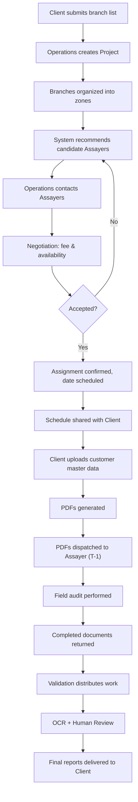
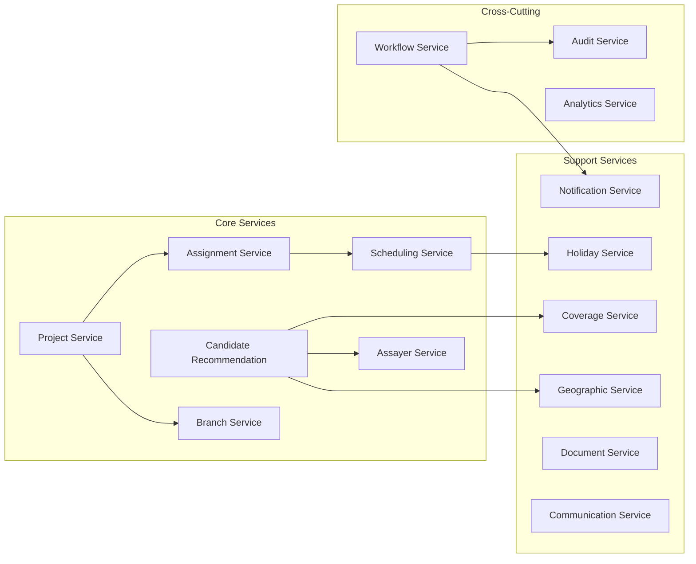
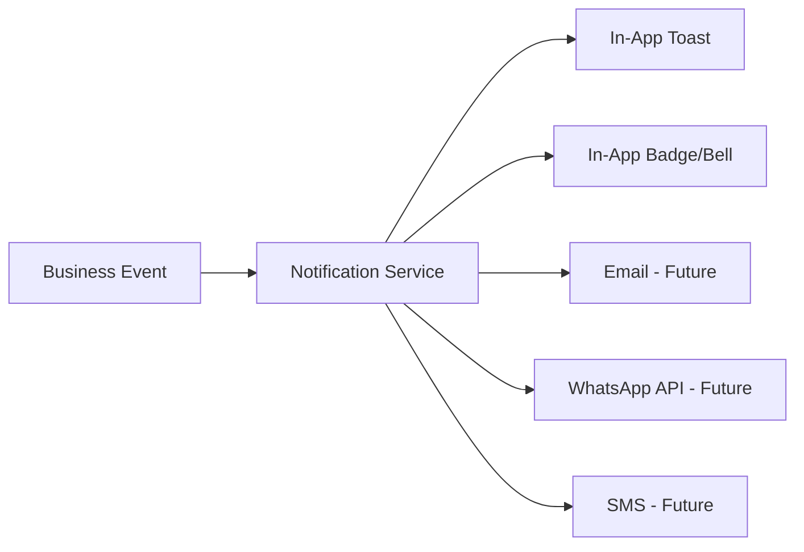
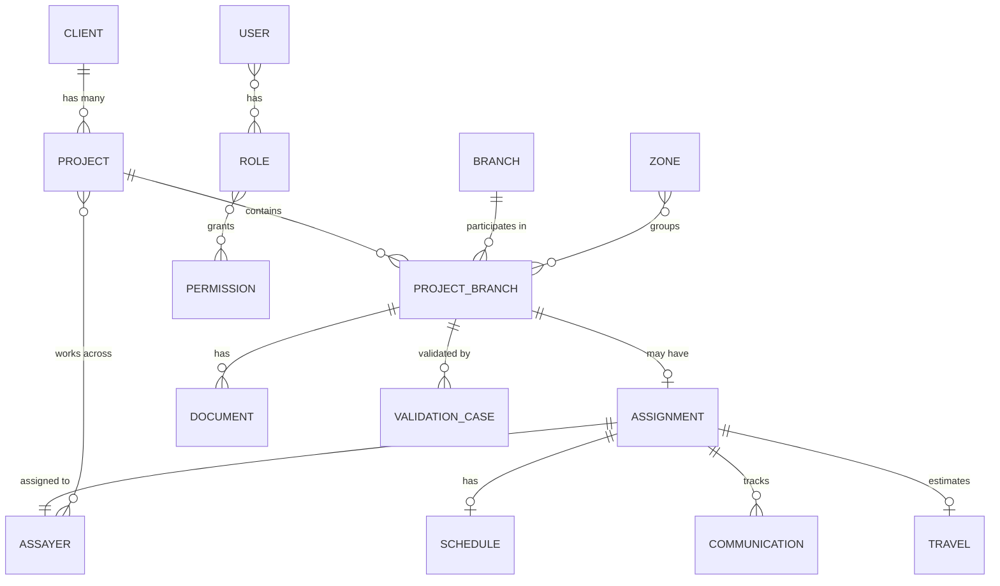

# FAPOMS — Architecture Proposal

**Field Audit Planning & Operations Management System**
**Version:** 1.0 — Architecture Review
**Date:** 2026-07-17

---

## 1. Executive Summary

FAPOMS is an enterprise operational platform for a company that provides field audit services to banking clients. The company receives lists of bank branches requiring audits, then plans, schedules, and coordinates external auditors ("Assayers") to visit those branches. Today this entire workflow is manual — relying on Excel sheets, phone calls, WhatsApp messages, personal memory, and operational experience.

The platform's purpose is **not** to automate auditors or replace operational judgment. It is a **decision-support and coordination backbone** that:

- Centralizes branch and Assayer master data
- Recommends suitable Assayers based on geographic proximity and workload
- Tracks the full planning → scheduling → execution → validation → reporting lifecycle
- Provides real-time coverage visibility (what % of branches are assigned)
- Preserves immutable operational history and audit trails
- Coordinates handoffs between Operations, Validation, Data Entry, OCR, and reporting teams

The system begins with a single banking client but must be architecturally prepared for multi-client and eventually multi-tenant operation without redesign.

---

## 2. Business Domain Understanding

### 2.1 Core Business Processes



### 2.2 Major Entities

| Entity                    | Classification   | Description                                                 |
| ------------------------- | ---------------- | ----------------------------------------------------------- |
| **Client**          | Master           | Banking institution requesting audits                       |
| **Project**         | Transaction      | One audit request cycle (typically monthly)                 |
| **Branch**          | Master           | Physical bank branch — permanent, shared across projects   |
| **Project Branch**  | Transaction      | One branch's participation in one project                   |
| **Assayer**         | Master           | External field auditor — permanent, shared across projects |
| **Assignment**      | Transaction      | Commitment: Assayer → Branch → Date                       |
| **Schedule**        | Transaction      | Confirmed audit date                                        |
| **Zone**            | Master/Config    | Operational grouping for planning convenience               |
| **Holiday**         | Reference/Config | Dates audits should not be scheduled                        |
| **Document**        | Transaction      | Files exchanged during the workflow                         |
| **Communication**   | Transaction      | Logged interactions related to assignments                  |
| **Travel**          | Transaction      | Distance/cost estimates for assignments                     |
| **Validation Case** | Transaction      | Post-audit OCR + human review unit                          |
| **User**            | Master           | Internal platform user                                      |
| **Coverage**        | Calculated       | (Assigned Branches / Total Branches) at various levels      |

### 2.3 User Roles

| Role                 | Primary Responsibility                                            |
| -------------------- | ----------------------------------------------------------------- |
| Super Administrator  | Platform config, org management, global settings                  |
| Administrator        | Operational config, user management, reports, master data         |
| Operations Manager   | Project planning, assignment planning, scheduling, coverage       |
| Operations Executive | Day-to-day execution, contacting Assayers, recording negotiations |
| Validation Manager   | Validation workflow, reviewer assignment, quality monitoring      |
| Validator            | OCR review, manual corrections, validation approval               |
| Document Executive   | Importing data, PDF generation, document dispatch & tracking      |
| Assayer              | View assigned work, update progress (future: mobile)              |
| Client User          | View own projects, view reports, download deliverables            |
| Read-Only Auditor    | Compliance review, audit history, reports                         |

### 2.4 Operational Lifecycle

The system manages two distinct but interconnected lifecycles:

**Project Lifecycle:** Draft → Planning → Scheduling → Execution → Validation → Completed → Archived

**Assignment Lifecycle:** Created → Candidate Selected → Contact Initiated → Negotiation → Accepted → Scheduled → Audit Completed → Closed (with Rejected/Cancelled as alternative paths)

Key constraint: **Planning is exploratory; assignments are commitments.** No permanent business commitments are created during the planning phase.

### 2.5 Business Objectives

1. **Maximize branch coverage** — every received branch should ideally be audited
2. **Reduce operational cost** — travel, coordination, and effort
3. **Reduce planning time** — faster Assayer identification via recommendations
4. **Improve visibility** — real-time project/coverage/assignment status
5. **Standardize operations** — replace fragmented Excel/phone workflows

---

## 3. Requirement Review

### 3.1 Confirmed Requirements

| #   | Requirement                                                                         | Source               |
| --- | ----------------------------------------------------------------------------------- | -------------------- |
| C1  | Multi-client architecture from Day 1                                                | Parts 1, 7           |
| C2  | Planning workspace with multi-panel layout (left/center/right/bottom)               | Part 9 §5           |
| C3  | Candidate recommendation engine based on proximity, workload, history               | Parts 4, 5, 9        |
| C4  | Real-time coverage calculation at project/zone/state/client levels                  | Parts 3, 5, 9        |
| C5  | Immutable audit trail on all business entities                                      | Parts 6, 7, 8        |
| C6  | RBAC + ABAC authorization model                                                     | Part 8               |
| C7  | Soft delete policy — no physical deletion of business entities                     | Part 7 §9           |
| C8  | State-machine driven entity lifecycles                                              | Part 6               |
| C9  | Holiday-aware scheduling with conflict detection                                    | Parts 2, 5, 6        |
| C10 | Document lifecycle tracking across departments                                      | Parts 3, 5, 6        |
| C11 | Geographic intelligence: distance calculation, nearby search, clustering            | Parts 3, 5           |
| C12 | Client-specific import mappings normalized to canonical model                       | Parts 1, 2, 7        |
| C13 | Business identifiers separate from system identifiers                               | Part 7 §12          |
| C14 | Configuration-driven behavior (SLA, thresholds, templates, etc.)                    | Constitution, Part 7 |
| C15 | Bulk operations with per-record audit trails                                        | Part 9 §16          |
| C16 | Enterprise table views: sort, filter, search, pagination, column config, export     | Part 10 §6          |
| C17 | Desktop-first responsive design (tablet secondary, mobile limited)                  | Part 10 §19         |
| C18 | Accepted assignments are operationally locked — reassignment requires cancellation | Parts 2, 6           |

### 3.2 Missing Requirements

| #   | Gap                                                                                                         | Why It Matters                                                | Recommendation                                            |
| --- | ----------------------------------------------------------------------------------------------------------- | ------------------------------------------------------------- | --------------------------------------------------------- |
| M1  | **No SLA definitions specified** — response time, audit completion deadlines, validation turnaround  | SLA drives notifications, escalations, and dashboard alerts   | Define SLA rules in configuration; leave flexible for now |
| M2  | **No data import format specified** — what does the client's branch list look like? CSV? Excel? API? | Drives import pipeline design                                 | Clarify with stakeholders; assume Excel/CSV initially     |
| M3  | **No fee structure model** — how are Assayer fees recorded? Per-branch? Per-visit? Fixed + variable? | Affects Assignment and Travel entities                        | Model as flexible fee records on Assignment               |
| M4  | **No explicit concurrency rules** — two planners working the same project simultaneously             | Could cause double-assignments or conflicting recommendations | Implement optimistic locking + real-time updates          |
| M5  | **No file storage requirements** — size limits, retention policy, accepted formats                   | Drives storage architecture                                   | Define reasonable defaults in configuration               |
| M6  | **No integration API specs** — PDF generation, OCR, external communication providers                 | These are listed as "outside" but workflow depends on them    | Define integration contracts as abstract interfaces       |
| M7  | **No disaster recovery or backup requirements**                                                       | Enterprise system needs RPO/RTO targets                       | Define with stakeholder input                             |
| M8  | **No explicit performance SLA** — "responsive" is subjective                                         | Drives infrastructure sizing and optimization strategy        | Define: list pages <500ms, search <1s, recommendation <3s |
| M9  | **No internationalization requirements** — language, currency, date formats                          | Future multi-language support mentioned but not specified     | Design with i18n-ready strings; default to English + INR  |
| M10 | **No explicit mobile/offline sync protocol** — future mobile app for Assayers                        | Part 9 §23 mentions offline planning                         | Design API to support eventual mobile client              |

### 3.3 Ambiguous Requirements

#### A1: Project Lifecycle vs. Assignment Planning Lifecycle Discrepancy

**The Issue:** Part 2 §3 defines Project lifecycle as: Draft → Planning → Scheduling → Execution → Validation → Completed → Archived. Part 3 §2 adds an "Assignment Planning" state between Planning and Scheduled. Part 6 §3 matches Part 2 but adds exceptional transitions.

**Why It Matters:** The number and names of states in the Project lifecycle must be consistent across all modules, the state machine implementation, and the database.

**Options:**

1. Use Part 6 as canonical (it is the State & Event Model spec and is the most authoritative for state definitions)
2. Merge into a unified superset: Draft → Planning → Assignment Planning → Scheduling → Execution → Validation → Completed → Archived

**Recommendation:** Option 1 — use Part 6 as canonical. "Assignment Planning" from Part 3 is a sub-phase of "Planning," not a separate top-level state. **User decision required.**

---

#### A2: Schedule vs. Assignment Relationship

**The Issue:** Part 2 §7 says "One Schedule belongs to One Project, One Branch, One Assayer." Part 7 §4 says Assignment owns Schedule (1:1). But Part 7 §5 says Schedule is owned by Assignment, and Project Branch has "Zero or One Schedule" independently.

**Why It Matters:** Is a Schedule an independent entity or always subordinate to an Assignment? This affects the data model and how schedules are created.

**Options:**

1. Schedule is always created through an Assignment (Assignment owns Schedule)
2. Schedule can exist independently (e.g., tentative scheduling before formal assignment)

**Recommendation:** Option 1 — Schedule is a child of Assignment. The workflow is clear: Assayer accepts → Schedule created. A standalone schedule without an assignment has no business meaning. **User decision required.**

---

#### A3: Coverage Calculation — "Confirmed Assignments" vs. "All Active States"

**The Issue:** Part 4 §8 defines coverage as "Confirmed Assignments ÷ Total Project Branches." Part 2 §15 defines it as "Assigned Branches ÷ Total Project Branches." Part 9 §15 lists "Planned branches, Remaining branches, Scheduled branches, Uncovered branches."

**Why It Matters:** Does a branch in "Negotiation" count as covered? Only "Accepted"? Only "Scheduled"?

**Options:**

1. Coverage = only Accepted/Scheduled/Completed assignments
2. Coverage = any branch with active planning (including Negotiation)
3. Multi-tier coverage: "Planned Coverage" vs. "Confirmed Coverage"

**Recommendation:** Option 3 — show both planned and confirmed coverage metrics. This gives the most useful operational picture. **User decision required.**

---

#### A4: Zone — Configurable Per-Client or Global?

**The Issue:** Part 2 §9 says zones are "operational planning groups" and "configurable." But it's unclear whether zones are per-Client, per-Project, or global.

**Why It Matters:** If zones are global, they can't support different clients with different geographic strategies. If per-project, they duplicate configuration.

**Recommendation:** Zones should be per-Client (each client may have different geographic strategies), but a project can override or extend the client's zone configuration. **User decision required.**

---

#### A5: Assayer "Primary State" — Geographic Limitation or Just Metadata?

**The Issue:** Part 2 §6 says an Assayer "Lives in one primary state." Part 9 §10 lists "Service area" as a recommendation factor. It's unclear whether an Assayer can only serve branches in their home state or can cover nearby states.

**Why It Matters:** This dramatically affects the recommendation engine's logic and the geographic search radius.

**Recommendation:** Model "primary state" as the Assayer's home location. The recommendation engine should use configurable distance thresholds rather than strict state boundaries. An Assayer near a state border should be recommended for nearby branches regardless of state lines. **User decision required.**

---

### 3.4 Potential Contradictions

#### P1: Project Branch States

Part 4 §5 defines planning states as: Not Planned → Candidate Search → Assayer Contacted → Negotiation → Accepted → Scheduled → Ready for Execution. Part 6 §4 defines states as: Imported → Planning → Assignment Confirmed → Scheduled → Audit Completed → Validation Completed → Closed. Part 9 §9 introduces yet another sequence. These three state machines overlap but differ in naming and granularity.

**Resolution needed:** Consolidate into one canonical Project Branch state machine before implementation.

#### P2: Scheduling Precondition

Part 6 §5 shows Assignment reaching "Scheduled" state. Part 3 §6 says "Scheduling only begins after Availability confirmation, Assignment acceptance." But Part 2 §7 says "Scheduling occurs before Customer data download." These are consistent but the relationship between Assignment.Scheduled state and Schedule entity is unclear — is "Scheduled" a state on the Assignment when a Schedule entity is attached, or an independent lifecycle?

**Resolution needed:** Clarify whether "Scheduled" on Assignment means a Schedule entity has been created and confirmed.

---

## 4. Proposed Technical Architecture

### 4.1 Overall Architecture Style

**Recommendation: Modular Monolith with Domain-Driven Design boundaries**

**Justification:**

- The specifications describe 13 logical modules with clear business boundaries — these map naturally to DDD bounded contexts
- The initial user base is small (one organization, one client) — a microservices architecture would add deployment and operational complexity without proportional benefit
- The Constitution explicitly states "Choose the simplest design that satisfies the business requirements" and "Avoid unnecessary abstraction"
- A well-structured modular monolith can be decomposed into services later if scaling demands it
- All modules share the same database and transactional boundaries, which simplifies consistency guarantees

**Module structure within the monolith:**

```
fapoms/
├── core/                    # Shared kernel (entities, value objects, events)
├── modules/
│   ├── client/              # Client Management
│   ├── project/             # Project Management
│   ├── branch/              # Branch Management
│   ├── assayer/             # Assayer Management
│   ├── planning/            # Assignment Planning (core module)
│   ├── assignment/          # Assignment Management
│   ├── scheduling/          # Scheduling
│   ├── geo/                 # Geographic Intelligence
│   ├── coverage/            # Coverage Analysis
│   ├── communication/       # Communication Tracking
│   ├── document/            # Document Management
│   ├── validation/          # Validation Coordination
│   └── analytics/           # Dashboard & Analytics
├── infrastructure/          # Cross-cutting: auth, events, storage, notifications
└── api/                     # REST API layer
```

Each module has internal layers: `domain/`, `service/`, `repository/`, `api/`.

---

### 4.2 Backend Architecture

**Recommendation: Node.js (TypeScript) with NestJS**

**Justification:**

- TypeScript provides type safety essential for a complex domain model with many entity relationships and state machines
- NestJS provides mature module system that maps directly to the 13 business modules
- Built-in dependency injection, guards (authorization), interceptors (audit logging), and pipes (validation)
- Excellent ecosystem for REST APIs, WebSockets (real-time coverage updates), and background jobs
- Same language as frontend reduces context-switching
- Strong ORM options (TypeORM, Prisma, MikroORM) for the complex data model

**Alternative considered:** Java/Spring Boot — stronger enterprise pedigree but higher ceremony for initial team. Python/Django — excellent admin but weaker type safety for complex domain. The choice should ultimately align with team expertise.

> [!IMPORTANT]
> The backend technology choice should be confirmed based on team expertise. The architecture is technology-agnostic — the same modular structure works with Java/Spring, Python/Django, or .NET.

---

### 4.3 Frontend Architecture

**Recommendation: React with TypeScript**

**Justification:**

- The Planning Workspace (Part 9 §5) requires a complex multi-panel layout with resizable panels — React's component model handles this well
- Enterprise table requirements (Part 10 §6: sort, filter, search, pagination, column config, export, bulk actions) are well-served by mature React table libraries (TanStack Table)
- Map integration (GIS module) has strong React support (react-leaflet, Mapbox GL JS)
- Desktop-first responsive design is straightforward with React + CSS Grid/Flexbox
- TypeScript shared types between frontend and backend via a shared package

---

### 4.4 Service Boundaries

Each module exposes its capabilities through a well-defined service layer:



Services communicate through direct method invocation within the monolith. If future decomposition is needed, these boundaries become service interfaces.

---

### 4.5 Background Jobs

| Job                      | Trigger                        | Description                                                                 |
| ------------------------ | ------------------------------ | --------------------------------------------------------------------------- |
| Branch Import            | User upload                    | Parse Excel/CSV, normalize, match existing branches, create ProjectBranches |
| Coverage Recalculation   | Assignment state change        | Recalculate project/zone/state coverage metrics                             |
| Candidate Recommendation | On-demand + batch              | Pre-compute nearby Assayers for unassigned branches                         |
| Schedule Reminder        | Cron (daily)                   | Identify T-1 audits requiring PDF dispatch                                  |
| PDF Generation           | Assignment reaches "Scheduled" | Trigger external PDF generation service                                     |
| Report Generation        | On-demand                      | Generate coverage/progress/utilization reports                              |
| Data Archival            | Cron (monthly)                 | Archive completed projects and compress historical data                     |
| Analytics Aggregation    | Cron (nightly)                 | Pre-compute dashboard metrics and trend data                                |

**Implementation:** Bull/BullMQ (Redis-backed job queue) for reliable, retryable background processing.

---

### 4.6 Event Processing Strategy

**Recommendation: Internal domain events with an in-process event bus**

Every state transition generates a business event (as required by Part 6 §2). These events are:

1. **Persisted** to an event log table (immutable audit trail)
2. **Published** to in-process subscribers that handle:
   - Notification dispatch
   - Coverage recalculation
   - Analytics aggregation
   - Workflow advancement

**Why not an external message broker (Kafka, RabbitMQ)?**

- The monolith processes events in the same process — no need for external infrastructure
- Events are persisted to the database for durability
- If the system is later decomposed, the event bus can be replaced with an external broker without changing producers

---

### 4.7 Storage Strategy

**Recommendation: PostgreSQL**

**Justification:**

- Rich data model with many relationships → relational database is the natural fit
- PostGIS extension provides native geographic queries (distance, radius search, clustering) — directly serving the GIS module
- JSON/JSONB columns for flexible configuration data and client-specific import mappings
- Mature row-level security support for future ABAC enforcement at the database layer
- Excellent full-text search capabilities for branch/Assayer search
- Strong audit and versioning support through triggers or application-level patterns

---

### 4.8 Search Strategy

**Tier 1 (Day 1):** PostgreSQL full-text search with GIN indexes for branch names, codes, Assayer names, and project names. This is sufficient for the initial scale.

**Tier 2 (Future):** If search volume or complexity grows, introduce Elasticsearch/OpenSearch for:

- Cross-entity global search
- Fuzzy matching on addresses
- Faceted search on dashboards
- Analytics queries

---

### 4.9 Caching Strategy

| Layer       | Technology                               | What's Cached                                                  |
| ----------- | ---------------------------------------- | -------------------------------------------------------------- |
| Application | In-memory (Node.js)                      | Reference data: statuses, roles, permissions, holiday calendar |
| Database    | PostgreSQL materialized views            | Coverage statistics, analytics aggregations                    |
| API         | HTTP cache headers (ETag, Last-Modified) | Master data responses, report downloads                        |
| Session     | Redis                                    | User sessions, access tokens, temporary planning state         |

Coverage metrics should be computed asynchronously and cached, not computed on every request.

---

### 4.10 Notification Architecture



**V1:** In-app notifications (WebSocket push to connected clients + persistent notification records).
**Future:** Email, SMS, WhatsApp Business API integration.

Notification templates should be configurable (Part 7 §2.4 Configuration Data).

---

### 4.11 File Storage Architecture

**Recommendation: Local filesystem (V1) with abstraction layer for future cloud migration**

| File Type                       | Storage  | Metadata        |
| ------------------------------- | -------- | --------------- |
| Branch import files (Excel/CSV) | Local/S3 | Document entity |
| Customer master data            | Local/S3 | Document entity |
| Generated PDFs                  | Local/S3 | Document entity |
| Returned audit documents        | Local/S3 | Document entity |
| Generated reports               | Local/S3 | Document entity |

All file operations go through a `FileStorageService` abstraction. The implementation can be swapped from local to S3/GCS/Azure Blob without affecting business logic.

File metadata (owner, version, status, timestamps) is stored in the database.

---

### 4.12 Deployment Architecture

**V1 (Single Server):**

```
┌─────────────────────────────────────┐
│          Reverse Proxy (Nginx)       │
├─────────────────┬───────────────────┤
│   Frontend      │   Backend API     │
│   (Static SPA)  │   (Node.js)       │
├─────────────────┴───────────────────┤
│   PostgreSQL + PostGIS               │
├──────────────────────────────────────┤
│   Redis (sessions, jobs, cache)      │
├──────────────────────────────────────┤
│   File Storage (local disk)          │
└──────────────────────────────────────┘
```

**Future (Scaled):**

- Containerized with Docker
- Orchestrated with Kubernetes or Docker Compose
- Database on managed service (AWS RDS / Azure Database for PostgreSQL)
- File storage on S3/GCS
- CDN for static frontend assets
- Horizontal API scaling behind load balancer

---

## 5. Database Design Strategy

### 5.1 Aggregate Boundaries

| Aggregate Root           | Owned Entities                                       | Referenced Entities      |
| ------------------------ | ---------------------------------------------------- | ------------------------ |
| **Client**         | ClientConfig                                         | —                       |
| **Project**        | ProjectBranch, ProjectDocument, ProjectProgress      | Client, Branch           |
| **Branch**         | BranchAddress, BranchLocation                        | State, District, City    |
| **Assayer**        | AssayerProfile, AssayerAvailability, AssayerDocument | State                    |
| **Assignment**     | Schedule, Communication, Travel, NegotiationHistory  | ProjectBranch, Assayer   |
| **ValidationCase** | OCRResult, ReviewRecord, Correction                  | ProjectBranch, Document  |
| **User**           | UserRole, UserPreference                             | Department, Organization |

Cross-aggregate references use IDs only — no embedded objects.

### 5.2 Entity Relationships



### 5.3 Normalization Strategy

- **3NF for master data** (Client, Branch, Assayer, User) — avoid redundancy
- **3NF for transaction data** (Project, Assignment, Schedule) — maintain referential integrity
- **Denormalized materialized views** for dashboards and analytics — pre-computed coverage, utilization stats
- **JSONB columns** for flexible/extensible data: client configuration, import mappings, notification templates

### 5.4 Partitioning Considerations

Not required for V1, but design for future partitioning:

- **Event log / audit trail:** Partition by month (this table grows fastest)
- **Projects:** Could be partitioned by client if multi-client volume is high
- **Documents:** Partition by year

### 5.5 Versioning Approach

- **Entity versioning:** Optimistic concurrency via `version` column on all mutable entities
- **Document versioning:** New row per version, linked to parent document
- **Configuration versioning:** New row per configuration change with effective dates
- **Schema versioning:** Database migrations with sequential numbering, never destructive

### 5.6 Audit Strategy

**Two complementary mechanisms:**

1. **Business audit trail:** An `audit_events` table capturing every business state transition with: entity_type, entity_id, event_type, previous_state, new_state, user_id, timestamp, ip_address, remarks, metadata (JSONB)
2. **Entity-level audit columns:** Every table includes `created_by`, `created_at`, `updated_by`, `updated_at`, `version`, `is_active`

The audit trail is append-only. No UPDATE or DELETE operations on audit records.

---

## 6. API Strategy

### 6.1 API Style

**REST with resource-oriented design**

Justification: The domain has clear resource boundaries (Projects, Branches, Assignments, Assayers), making REST natural. GraphQL would add complexity without proportional benefit for this domain.

### 6.2 Versioning

**URI path versioning:** `/api/v1/projects`, `/api/v1/assignments`

New versions introduced only for breaking changes. Non-breaking additions (new optional fields) do not require version bumps.

### 6.3 Authentication

**JWT (JSON Web Tokens):**

- Short-lived access tokens (15-30 minutes)
- Long-lived refresh tokens (7-30 days, stored in database, revocable)
- Refresh token rotation on every use
- Forced logout by invalidating all refresh tokens

### 6.4 Authorization

**Middleware chain:**

1. Authentication guard (validate JWT)
2. Role guard (check RBAC permissions)
3. Attribute guard (evaluate ABAC rules per Part 8 §10)
4. Entity state guard (e.g., completed project is read-only)

Permissions encoded as: `resource:action:scope` (e.g., `assignment:create:own_region`)

### 6.5 Error Handling

Standardized error response:

```json
{
  "error": {
    "code": "ASSIGNMENT_ALREADY_ACCEPTED",
    "message": "This assignment has already been accepted and cannot be modified.",
    "details": [{ "field": "status", "constraint": "immutable_after_acceptance" }],
    "traceId": "abc-123-def"
  }
}
```

HTTP status codes used consistently: 400 (validation), 401 (authentication), 403 (authorization), 404 (not found), 409 (state conflict), 422 (business rule violation), 500 (server error).

### 6.6 Pagination

**Cursor-based pagination** for large datasets (branches, assignments, audit logs):

```
GET /api/v1/projects/123/branches?cursor=eyJ...&limit=50
```

**Offset-based pagination** for simpler lists where cursor complexity isn't needed.

### 6.7 Filtering

**Query parameter convention:**

```
GET /api/v1/branches?state=Maharashtra&district=Pune&status=active&sort=-created_at
```

Complex filters support a filter query language for advanced search.

### 6.8 Bulk Operations

```
POST /api/v1/assignments/bulk
{
  "action": "update_status",
  "ids": ["uuid1", "uuid2", "uuid3"],
  "data": { "status": "contacted" },
  "remarks": "Batch contact initiation"
}
```

Response includes per-record results:

```json
{
  "results": [
    { "id": "uuid1", "status": "success" },
    { "id": "uuid2", "status": "error", "error": "Already in negotiation" }
  ]
}
```

Every individual record in a bulk operation gets its own audit event.

---

## 7. Frontend Strategy

### 7.1 Application Architecture

```
src/
├── app/                     # App shell, routing, providers
├── modules/                 # Feature modules (mirror backend)
│   ├── dashboard/
│   ├── projects/
│   ├── branches/
│   ├── assayers/
│   ├── planning/           # The core Planning Workspace
│   ├── assignments/
│   ├── scheduling/
│   ├── documents/
│   ├── validation/
│   ├── reports/
│   └── admin/
├── shared/
│   ├── components/          # Reusable UI components
│   ├── hooks/              # Shared React hooks
│   ├── services/           # API client, auth, storage
│   └── utils/              # Formatters, validators
├── design-system/          # Tokens, theme, base styles
└── types/                  # Shared TypeScript types
```

### 7.2 State Management

| State Type                           | Solution                                                                |
| ------------------------------------ | ----------------------------------------------------------------------- |
| Server state (API data)              | TanStack Query (React Query) — caching, pagination, optimistic updates |
| UI state (panels, modals)            | React component state / Context                                         |
| Form state                           | React Hook Form                                                         |
| Global app state (auth, preferences) | Zustand or React Context                                                |
| Real-time updates                    | WebSocket subscription → React Query cache invalidation                |

### 7.3 Routing

**React Router with nested layouts:**

```
/dashboard
/projects
/projects/:id
/projects/:id/planning          ← Planning Workspace
/branches
/branches/:id
/assayers
/assayers/:id
/assignments
/assignments/:id
/scheduling
/documents
/validation
/reports
/admin/users
/admin/roles
/admin/configuration
```

### 7.4 UI Component Organization

Based on Part 10's screen type taxonomy:

| Component Category        | Examples                                                      |
| ------------------------- | ------------------------------------------------------------- |
| **Layout**          | AppShell, SideNav, Breadcrumbs, MultiPanelWorkspace           |
| **Data Display**    | DataTable, DetailView, Timeline, AuditHistory, StatusBadge    |
| **Input**           | FormField, SearchInput, FilterPanel, DatePicker, AutoComplete |
| **Feedback**        | Toast, ConfirmDialog, ProgressIndicator, EmptyState           |
| **Domain-Specific** | CoverageGauge, PlanningMap, CandidateCard, AssignmentCard     |

### 7.5 Module Organization

Each feature module contains:

```
modules/planning/
├── components/          # Module-specific components
├── pages/              # Route-level pages
├── hooks/              # Module-specific hooks
├── services/           # API calls for this module
├── types/              # Module-specific types
└── index.ts            # Public exports
```

### 7.6 Performance Strategy

| Technique          | Application                                              |
| ------------------ | -------------------------------------------------------- |
| Code splitting     | Per-module lazy loading via React.lazy                   |
| Virtual scrolling  | Branch lists with thousands of records                   |
| Debounced search   | Branch/Assayer search inputs                             |
| Optimistic updates | Assignment status changes                                |
| Memoization        | Coverage calculations, candidate rankings                |
| WebSocket          | Real-time coverage updates, concurrent planner awareness |
| Service Worker     | Offline capability (future)                              |

---

## 8. Scalability Review

### 8.1 Current Architecture Limitations

| Limitation                 | Impact                                       | Mitigation Path                             |
| -------------------------- | -------------------------------------------- | ------------------------------------------- |
| Single database            | Write bottleneck at scale                    | Read replicas → eventual sharding          |
| Monolithic deployment      | Cannot scale modules independently           | Modular boundaries enable future extraction |
| In-process events          | Single point of failure for event processing | Can be replaced with external broker        |
| Single-server file storage | Storage capacity limited                     | Abstract storage layer → cloud migration   |

### 8.2 Future Scaling Opportunities

- **Read replicas** for analytics/reporting queries (separate read model)
- **Module extraction** — the Planning module could become its own service if it becomes a bottleneck
- **Geographic partitioning** — if multi-tenant, databases could be partitioned by region
- **CDN** for static assets and generated reports

### 8.3 Multi-Tenant Readiness

The specifications mention future multi-organization support. The design accommodates this through:

- `organization_id` column ready to be added to relevant tables
- Authorization scopes already include "Organization" and "Entire Platform" levels
- Client configuration is already per-client rather than global
- User management already supports organizational scope

### 8.4 Horizontal Scaling

The stateless service layer (per Constitution §Stateless Services) enables horizontal scaling of the API tier. State is stored in PostgreSQL and Redis, both of which support clustering.

### 8.5 Performance Bottlenecks

| Bottleneck               | Scenario                                      | Mitigation                                           |
| ------------------------ | --------------------------------------------- | ---------------------------------------------------- |
| Candidate recommendation | Thousands of branches × hundreds of Assayers | Pre-compute recommendations, PostGIS spatial indexes |
| Coverage recalculation   | Every assignment state change triggers recalc | Async event-driven recalculation + caching           |
| Branch import            | Large Excel files (10k+ rows)                 | Background job with progress reporting               |
| Audit log queries        | Historical queries on millions of events      | Partitioned audit table, indexed by entity + time    |

---

## 9. Security Review

### 9.1 Authentication

- JWT with short-lived access tokens — limits exposure window
- Refresh token rotation — prevents token reuse
- Password hashing with bcrypt/argon2 — industry standard
- Account lockout after failed attempts — brute force protection
- Session invalidation on password change — prevents stale sessions

> [!WARNING]
> The specification mentions "Username & Password" and "Email & Password" as separate auth methods (Part 8 §4). Clarify whether these are two entry points for the same credential or genuinely different credential types.

### 9.2 Authorization

- RBAC provides baseline access control — simple and auditable
- ABAC adds contextual rules — "only own records," "only own region"
- Entity state guards prevent unauthorized modifications — "completed project is read-only"
- All authorization checks happen server-side — frontend restrictions are UX, not security

**Recommendation:** Implement a centralized policy evaluation service rather than scattering authorization logic across controllers.

### 9.3 Auditability

Part 8 §14 requirements are comprehensive. Implementation should include:

- Audit events stored in a separate, append-only table
- No application-level DELETE access to audit records
- IP address and user agent captured on every request
- Sensitive field changes logged with before/after values

### 9.4 Data Protection

- Encrypt sensitive data at rest (Assayer personal information, contact details)
- TLS for all API communication
- Database connection encryption
- Parameterized queries — no SQL injection
- Input sanitization — no XSS
- CORS configuration — whitelist allowed origins
- Rate limiting on authentication endpoints

### 9.5 File Security

- Validate file types and sizes on upload
- Store files outside the web root
- Generate pre-signed URLs for downloads (don't serve directly)
- Scan uploads for malware (future)
- Enforce authorization before file access

### 9.6 API Security

- CSRF protection for browser-based clients
- Request rate limiting per user and per IP
- Request body size limits
- API key support for future machine-to-machine integrations
- No sensitive data in URLs or logs

---

## 10. Risks

### 10.1 Technical Risks

| Risk                                                                                                             | Probability | Impact | Mitigation                                                                                |
| ---------------------------------------------------------------------------------------------------------------- | ----------- | ------ | ----------------------------------------------------------------------------------------- |
| **Geographic distance calculations at scale** — computing distances for thousands of branch-Assayer pairs | Medium      | High   | Use PostGIS spatial indexes, pre-compute nearest Assayers, cache results                  |
| **State machine complexity** — multiple entities with complex state machines could become error-prone     | Medium      | High   | Use a state machine library (e.g., XState), comprehensive unit tests for every transition |
| **Concurrent planning conflicts** — two planners assigning the same Assayer simultaneously                | Medium      | Medium | Optimistic locking + WebSocket-based real-time updates showing other planners' selections |
| **Data import fragility** — client Excel formats may change without notice                                | High        | Medium | Configurable import mappings, validation layer, clear error reporting                     |
| **Integration dependency** — PDF generation and OCR are external systems with unclear APIs                | Medium      | Medium | Abstract integration interfaces, circuit breakers, graceful degradation                   |

### 10.2 Business Risks

| Risk                                                                                                   | Probability | Impact   | Mitigation                                                                                 |
| ------------------------------------------------------------------------------------------------------ | ----------- | -------- | ------------------------------------------------------------------------------------------ |
| **User adoption** — Operations team may prefer existing Excel/phone workflow                    | High        | Critical | Invest in UX, ensure system is faster than manual process, involve users early             |
| **Recommendation quality** — if candidate suggestions are poor, trust erodes                    | Medium      | High     | Start with transparent, simple recommendations (distance-based), iterate based on feedback |
| **Data completeness** — system value depends on accurate branch locations and Assayer addresses | High        | High     | Data validation on import, geocoding integration, progressive data enrichment              |
| **Scope creep** — downstream modules (OCR, PDF, reporting) may consume development capacity     | Medium      | Medium   | Strict V1 scope boundaries, integration contracts only                                     |

### 10.3 Architectural Risks

| Risk                                                                                                    | Probability | Impact | Mitigation                                                               |
| ------------------------------------------------------------------------------------------------------- | ----------- | ------ | ------------------------------------------------------------------------ |
| **Monolith growth** — without discipline, module boundaries erode                                | Medium      | High   | Enforce module interfaces, architectural fitness functions, code reviews |
| **Event sourcing pressure** — the immutable audit trail may be confused with full event sourcing | Low         | Medium | Clear separation: audit trail is a log, not the source of truth          |
| **Premature optimization** — over-engineering geographic search before knowing real data volumes | Medium      | Low    | Start simple (radius query), measure, optimize when data shows need      |

---

## 11. Implementation Roadmap

### Phase 1: Foundation (Weeks 1-4)

**What:** Project scaffolding, authentication, core entities, design system
**Why:** Everything depends on auth, data model, and UI foundation

- [ ] Project setup (monorepo, build tooling, CI)
- [ ] Database schema: users, roles, permissions, audit_events
- [ ] Authentication & session management
- [ ] Authorization framework (RBAC + ABAC)
- [ ] Design system: tokens, layout shell, navigation, data table, form components
- [ ] Master data: State, District, City reference tables + seed data

---

### Phase 2: Master Data (Weeks 5-8)

**What:** Client, Branch, Assayer management
**Why:** These are prerequisite master data for all operational modules

- [ ] Client module: CRUD, configuration
- [ ] Branch module: CRUD, import from Excel, geocoding, deduplication
- [ ] Assayer module: CRUD, profile, status management, geographic info
- [ ] Holiday module: calendar management
- [ ] Zone module: CRUD, configuration

---

### Phase 3: Core Planning (Weeks 9-14)

**What:** Project management, Assignment Planning Workspace
**Why:** This is the operational heart of the system — the highest business value

- [ ] Project module: create, lifecycle management, branch import
- [ ] Project Branch management: status tracking, state machine
- [ ] Geographic service: PostGIS setup, distance calculation, nearby search
- [ ] Candidate recommendation engine
- [ ] Planning Workspace UI: multi-panel layout, branch queue, candidate panel
- [ ] Map integration: branches + Assayers visualization
- [ ] Coverage service: real-time calculation and display

---

### Phase 4: Assignment & Scheduling (Weeks 15-18)

**What:** Assignment lifecycle, scheduling, calendar
**Why:** Converts planning decisions into operational commitments

- [ ] Assignment module: create, state machine, negotiation tracking
- [ ] Scheduling module: date validation, holiday conflicts, double-booking prevention
- [ ] Communication tracking: log contact attempts, outcomes
- [ ] Assignment detail view with full timeline

---

### Phase 5: Execution & Coordination (Weeks 19-22)

**What:** Document management, workflow coordination, notifications
**Why:** Supports the post-planning operational workflow

- [ ] Document module: upload, versioning, tracking, download
- [ ] Workflow service: enforce process ordering
- [ ] Notification service: in-app notifications
- [ ] Integration contracts for PDF generation and OCR (interfaces only)

---

### Phase 6: Validation & Reporting (Weeks 23-26)

**What:** Validation coordination, dashboards, analytics, reports
**Why:** Completes the end-to-end workflow and provides management visibility

- [ ] Validation module: queue management, review workflow
- [ ] Dashboard: role-specific operational views
- [ ] Analytics service: coverage trends, assignment statistics
- [ ] Report generation: PDF and spreadsheet export
- [ ] Global search

---

### Phase 7: Hardening & Launch (Weeks 27-30)

**What:** Security hardening, performance optimization, UAT, deployment
**Why:** Production readiness

- [ ] Security audit and penetration testing
- [ ] Performance testing with realistic data volumes
- [ ] Backup and recovery procedures
- [ ] User acceptance testing
- [ ] Documentation: user guide, admin guide, API documentation
- [ ] Production deployment

---

## 12. Open Questions

### Critical (Must Answer Before Implementation)

| #  | Question                                                                                                                                       | Context  |
| -- | ---------------------------------------------------------------------------------------------------------------------------------------------- | -------- |
| Q1 | **What technology stack does the team prefer?** Node.js/NestJS + React is recommended but team expertise should drive the decision.      | §4.2    |
| Q2 | **What is the canonical Project Branch state machine?** Three different specs define different states.                                   | §3.4 P1 |
| Q3 | **Is Schedule always owned by Assignment, or can it exist independently?**                                                               | §3.3 A2 |
| Q4 | **What counts as "covered" for coverage calculations?** Only Accepted+? Or Negotiation+ too?                                             | §3.3 A3 |
| Q5 | **What format(s) does the client's branch list come in?** Excel columns, CSV structure, API?                                             | §3.2 M2 |
| Q6 | **What are the external integration contracts?** How does PDF generation work? How does OCR integration work?                            | §3.2 M6 |
| Q7 | **How should concurrent planners be handled?** Pessimistic locking (one planner per project)? Optimistic (real-time conflict detection)? | §3.2 M4 |

### Important (Should Answer Before Phase 3)

| #   | Question                                                                                             | Context    |
| --- | ---------------------------------------------------------------------------------------------------- | ---------- |
| Q8  | **What distance thresholds define "nearby"?** Default search radius for candidate Assayers?    | GIS module |
| Q9  | **Can Assayers serve across state boundaries?**                                                | §3.3 A5   |
| Q10 | **Are zones per-Client or global?**                                                            | §3.3 A4   |
| Q11 | **What is the fee structure?** Fixed per branch? Negotiable? Multiple components?              | §3.2 M3   |
| Q12 | **What are the performance targets?** Max response time for search, recommendation, page load? | §3.2 M8   |
| Q13 | **What geocoding provider should be used?** Google Maps, Mapbox, OpenStreetMap/Nominatim?      | GIS module |
| Q14 | **Is "Username & Password" different from "Email & Password"?**                                | §9.1      |

### Optional (Can Defer to Later Phases)

| #   | Question                                                          | Context                                     |
| --- | ----------------------------------------------------------------- | ------------------------------------------- |
| Q15 | **When should mobile Assayer app development begin?**       | Part 1 §6, Part 9 §23                     |
| Q16 | **What email/SMS/WhatsApp providers should be integrated?** | Notification architecture                   |
| Q17 | **Should the system support dark mode in V1?**              | Part 10 §22                                |
| Q18 | **What backup/DR requirements exist?** RPO, RTO?            | §3.2 M7                                    |
| Q19 | **Is multi-language support needed for V1?**                | §3.2 M9                                    |
| Q20 | **Should saved views/filter presets be supported in V1?**   | Part 10 §6 mentions "Saved views (future)" |

---

> [!IMPORTANT]
> This architecture proposal is ready for review. No code, database schemas, or implementation artifacts have been created. All decisions documented above require explicit approval before proceeding to implementation.
